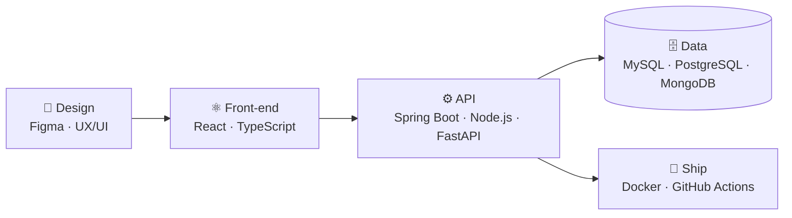
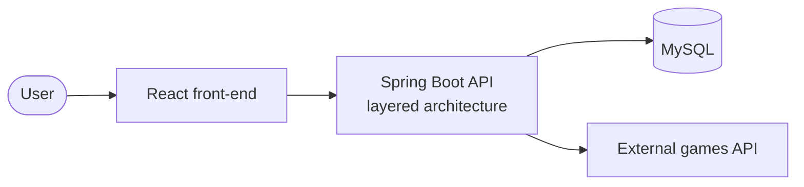
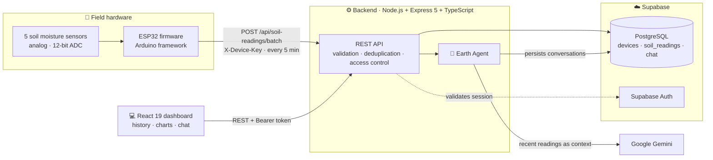
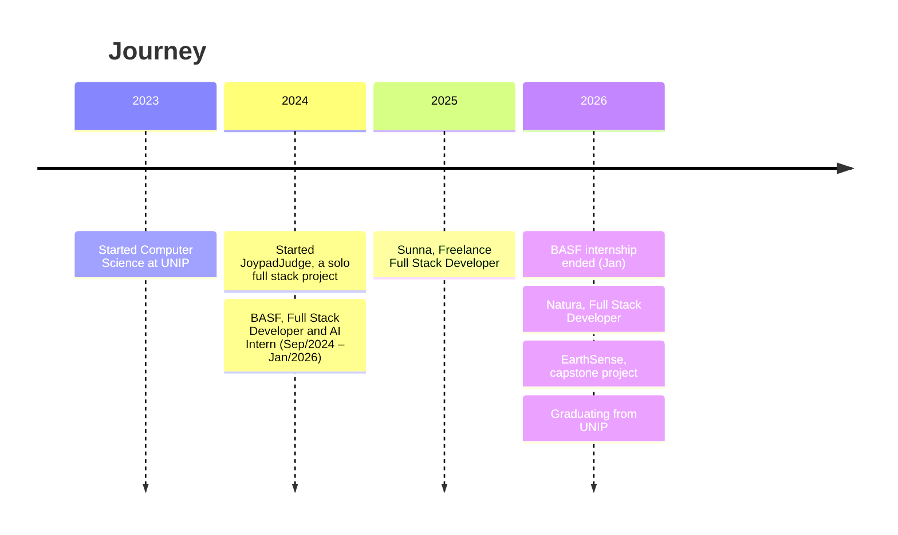

<picture>
  <source media="(prefers-color-scheme: dark)" srcset="./assets/banner-dark.svg">
  <source media="(prefers-color-scheme: light)" srcset="./assets/banner-light.svg">
  
</picture>

## 👋 About me

Full Stack Developer with 2+ years of experience across the whole software development lifecycle, from architecture design to front-end and back-end implementation. I like building scalable web and mobile applications and integrating APIs, always aiming for clean, maintainable code.

I'm finishing my **Computer Science** degree at **Universidade Paulista (UNIP)** and currently work as a Full Stack Developer at **Natura**.

> [!NOTE]
> Code from my professional work is not public, so this profile highlights my academic and personal projects.

## 🧭 How I build

## 🛠️ Tech stack

| | |
|:--|:--|
| **Front-end** |  |
| **Back-end** |  |
| **Databases** |  |
| **DevOps & Cloud** |  |
| **Testing & Design** |  |

Also: React Native · ESP32 / Arduino (IoT) · Google Gemini API · JUnit · Flyway · Jira · Spring Security · REST & GraphQL APIs

## 🚀 Featured projects

### 🎮 JoypadJudge — Game review platform
A full stack web application where users review and discuss games, built as a **solo project** in which I took on every role: architecture, UX/UI design (Figma), front-end, back-end and database administration.

**Tech:** Java · Spring Boot · Maven · MySQL · React · Node.js · Figma
*The repository is private and the application is currently offline.*

---

### 🌱 [EarthSense](https://github.com/caiopa22/earth-sense) — Capstone project (TCC)
**Soil moisture monitoring using IoT, artificial intelligence and a web dashboard.** Group capstone project (4 students) for the Computer Science degree at UNIP.

EarthSense is an applied-research prototype that integrates the whole data path of periodic soil moisture monitoring: embedded acquisition with an **ESP32** and five analog sensors, authenticated batch transmission, a validated **REST API**, relational storage, a **React dashboard** with history and charts, and the **Earth Agent**, a conversational assistant powered by **Google Gemini** that answers questions in natural language using the user's most recent readings.

**Tech:** ESP32 · Arduino · Node.js · Express 5 · TypeScript · React 19 · Vite · Tailwind CSS · Recharts · Supabase (PostgreSQL + Auth) · Google Gemini API

<b>📈 Validation results</b>

 

Analysis of **1,000 records** (5 sensors, 249 reception timestamps) collected on Sep 27–28, 2026:

| Check | Result |
|:--|:--|
| Median interval between receptions | **301.33 s** (configured period: 300 s) |
| Duplicates by device, batch and sensor | **None** |
| Percentages within 0–100% and raw values within 0–4095 | **All records** |
| Difference between stored percentage and firmware interpolation | **< 0.01 percentage point** |
| Sensor error *(reported by the team)* | 3% |
| API response time *(reported by the team)* | 140 ms |

The curves showed slow variation overnight and sharper drops during the reported sun exposure, with relative stabilization in the sensors that returned to shade.

<b>🗺️ Journey</b>

 

<b>💼 Experience details</b>

 

**Natura — Full Stack Developer** *(Jan/2026 – Present)*
- Web and mobile applications with React, React Native and TypeScript
- Defined front-end architecture (state, contexts and stores) and implemented i18n and responsive interfaces
- Developed and integrated microservices consuming REST and GraphQL APIs
- Back-end with Node.js: authentication, PostgreSQL and ScyllaDB integration
- Agile workflow with Jira; AI tools (Gemini CLI, GitHub Copilot) to boost productivity and code quality

**BASF — Full Stack Developer & AI Intern** *(Sep/2024 – Jan/2026)*
- Web applications and interactive systems with React, Java (Spring Boot) and Python (FastAPI)
- AI-integrated applications: chatbots and data dashboards using OpenAI APIs and Machine Learning models
- Unit tests with Jest and JUnit, following Clean Code and SOLID principles
- Worked with cross-functional teams (Kanban, Scrum); created UX/UI prototypes and project documentation

**Sunna — Full Stack Developer, Freelance** *(Sep/2025 – Jan/2026)*
- Front-end architecture for web and mobile with React and React Native, including state management and navigation
- Responsive interfaces and reusable components with Tailwind CSS
- Back-end with Spring Boot: Flyway migrations and Spring Security; REST API integration

<b>🌎 Languages & education</b>

 

- **Education:** B.Sc. in Computer Science, Universidade Paulista (UNIP) — Feb/2023 to Dec/2026
- **Courses:** Alura and Udemy certifications in Java (Spring Boot), React, Node.js and Databases
- **Languages:** Portuguese (Fluent) · English (Fluent) · Spanish (Intermediate)

## 📫 Let's talk

If you want to chat about full stack development, UX or AI-powered products, reach out on [LinkedIn](https://www.linkedin.com/in/caio-pacheco22/) or by email at **caiopacheco060@gmail.com**.
